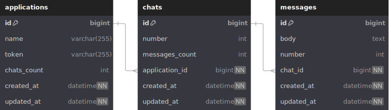

# Instabug Chat API

This is a **Rails-based API** for managing chat applications, chats, and messages. The project leverages **Docker** for easy setup and deployment. It includes:

- **MySQL** as the database.
- **Redis** as queuing system.
- **Sidekiq** for handling background jobs.
- **Elasticsearch** for full-text search.

---

## Models Overview

The system revolves around three main entities: **Applications**, **Chats**, and **Messages**. Their relationships are as follows:

### Applications to Chats (One-to-Many)
- One Application can have many Chats.
- This is represented by the foreign key `application_id` in the `chats` table.
- The `NOT NULL` constraint ensures each chat belongs to an application.

### Chats to Messages (One-to-Many)
- One Chat can have many Messages.
- This is represented by the foreign key `chat_id` in the `messages` table.
- The `NOT NULL` constraint ensures each message belongs to a chat.

### Unique Constraints
- In the `chats` table: `(application_id, number) [unique]`
  - Ensures that chat numbers are unique within each application (e.g., App1 can have Chat1, Chat2; App2 can have Chat1, Chat2).
- In the `messages` table: `(chat_id, number) [unique]`
  - Ensures message numbers are unique within each chat (e.g., Chat1 can have Message1, Message2; Chat2 can have Message1, Message2).

### Implicit Relations
While there's no direct relationship between **Applications** and **Messages** in the schema, an implicit relationship exists through **Chats**. A message can be traced to its application via its chat.

### Counts and Integrity
- The `applications` table has a `chats_count` field to quickly retrieve the number of chats for an application.
- The `chats` table has a `messages_count` field to count messages for a chat.
- These counts are managed to ensure consistency with the actual number of related records.

### Hierarchical Structure
The system follows this hierarchy:
**Applications > Chats > Messages**

This structure allows efficient querying, such as fetching all chats for an application or all messages in a chat.

---

## Database Indexes

### Applications Table
- `index_applications_on_token`: Single-column index on `token`
  - Purpose: Quick application lookup by token.

### Chats Table
- `index_chats_on_application_id`: Single-column index on `application_id`
  - Purpose: Efficient queries for chats within an application.
- `index_chats_on_number_and_application_id`: Composite index on `number` and `application_id`
  - Purpose: Fast lookup of specific chats by number within an application.

### Messages Table
- `index_messages_on_chat_id`: Single-column index on `chat_id`
  - Purpose: Efficient queries for messages within a chat.
- `index_messages_on_number_and_chat_id`: Composite index on `number` and `chat_id`
  - Purpose: Quick retrieval of specific messages by number within a chat.

---

## Continuous Integration and Deployment (CI/CD)

We use **GitHub Actions** for our CI/CD pipeline. The workflow automates the following processes:

- **Docker bootstrapping**: Sets up the Docker environment for testing.
- **End-to-End testing**: Runs the `Python e2e_tests.py` script to ensure all API endpoints are functioning correctly.

The CI/CD pipeline is triggered on every push to the `main` branch and for all pull requests. This ensures that any changes to the codebase are automatically tested before being merged or deployed.

---

## Prerequisites

- **Docker**
- **Docker Compose**

---


## Setting Up the Application

1. Clone the repository:
   ```
   git clone https://github.com/OmarAshour02/chat_system.git
   cd chat_system
   ```

2. Build the Docker images:
   ```
   docker-compose build
   ```

3. Create and set up the database:
   ```
   docker-compose run web /rails/bin/rails db:create db:migrate
   ```

## Running the Application

1. Start the application:
   ```
   docker-compose up
   ```

2. The API will be available at `http://localhost:3000`

## API Endpoints

### Applications

- Create a new application:
  ```
  POST /api/v1/applications
  ```
- List all applications:
  ```
  GET /api/v1/applications
  ```
- Get application details:
  ```
  GET /api/v1/applications/:token
  ```

- Update an application:
  ```
  PUT /api/v1/applications/:token
  ```
### Chats

- Create a new chat:
  ```
  POST /api/v1/applications/:application_token/chats
  ```

- List all chats for an application:
  ```
  GET /api/v1/applications/:application_token/chats
  ```

- Get chat details:
  ```
  GET /api/v1/applications/:application_token/chats/:number
  ```

### Messages

- Create a new message:
  ```
  POST /api/v1/applications/:application_token/chats/:chat_number/messages
  ```

- List all messages in a chat:
  ```
  GET /api/v1/applications/:application_token/chats/:chat_number/messages
  ```

- Search messages:
  ```
  GET /api/v1/applications/:application_token/chats/:chat_number/messages/search?query=:query
  ```

## Troubleshooting

If you encounter any issues, please check the Docker logs:

```
docker-compose logs
```
## Testing
Unit Tests

We use RSpec for unit testing. To run the tests, install the project locally and then run:

```
rails spec
```
This will run all the tests in the spec directory.

## End-to-End Tests
We have a Python script for end-to-end testing which runs automatically in the github actions workflow. To run these tests:

Make sure the application is running (docker-compose up) & you have python installed on your machine
Run the Python script:

```
python chat_api_e2e_test.py
```

This script tests the full flow of creating applications, chats, and messages, ensuring that the API endpoints work as expected in a real-world scenario.
For more specific logs:

```
docker-compose logs web
docker-compose logs sidekiq
```

## Contributing

Please read CONTRIBUTING.md for details on our code of conduct, and the process for submitting pull requests to us.

## License

This project is licensed under the MIT License - see the LICENSE.md file for details.
